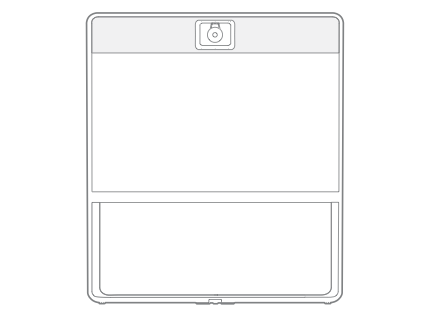

Title: Spark OBTP
Desc: Mobile and Desktop OBTP (One Button to Push) prototype.
Date: 2017-1-20
Cover: prototypes/cover/Spark OBTP_Cover.png
 
---

#### Mobile Prototype

[https://uxccds.github.io/SparkMobile/SparkMobileP5/](https://uxccds.github.io/SparkMobile/SparkMobileP5/)

#### Desktop Prototype

[https://uxccds.github.io/Spark-Hype-MVO/OBTP-Prototype.html](https://uxccds.github.io/Spark-Hype-MVO/OBTP-Prototype.html)

#### MX800 Prototype

[https://uxccds.github.io/SparkMobile/pair/page/mx.html](https://uxccds.github.io/SparkMobile/pair/page/mx.html)

# Instructions

### On Mobile

1. For the most optimal experience, use Chrome (mobile mode) or IPhone (webapp mode) to view this prototype.

2. Select a scenario and continue.

3. If you encounter any issues, clear the  browser cache and reload page.

### On Desktop

1. Please use Chrome browser to view this prototype.

### On MX800
*Disclaimer: This is simulating an experience on the Sparkboard by using a secondary desktop (e.g. Laptop)*

1. From the laptop, run the prototype in Chrome browser and pair/screen shared to a Spark Board

2. Use the following hot keys to navigate through the steps:

* '1' - Trigger the greeting and update the mobile/desktop prototype

* 'd' - Switch to desktop user (Brandon)

* 'm' - Switch to mobile user (Catherine)

3. Add a parameter after the url for both MX prototype and mobile/desktop prototype.

e.g.: 

The link for mobile index page	
[SparkMobileP5/?room=public](https://uxccds.github.io/SparkMobile/SparkMobileP5/?room=public)

The link for MX
[mx.html?room=public](https://uxccds.github.io/SparkMobile/pair/page/mx.html?room=public)

In this example, the parameter added is 'room'.
The parameter's value can be 'CCDS', 'UE', 'UT', 'private' or 'public'.

4. Only when the mx prototype and mobile/desktop prototype use the same name will they be paired.

