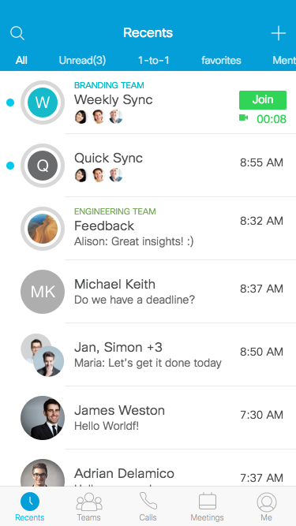

Title: Spark P1 2016
Desc: Spark P1 prototype.
Date: 2016-9-1
Cover: prototypes/cover/Spark P1 2016_Cover.png
---
#Summary
To let users to adapt to our new Sparl desogm more smoothly, UXCCDS team defined 5 steps to update spark app's style. This is the P1 prototype.

#### Prototype Link

[p1.html](https://uxccds.github.io/SparkMobile/v2/page/p1.html)

#### Screen shot

# Launching the prototype

You can launch this prototype through the following ways: 

1) Open the prototype in Chrome's mobile simulator. Click [here](../guide/chrome's-mobile-simulator.html) to get more.

2) Install the prototype on your iPhone as a web app. Click [here](../guide/install-web-app.html) to learn more about this method.

# Instructions

1) Click the 'Branding team' 's line to enter its room.

2) Click the activity board's icon on the top-right corner to open it.

3) Click on each ball on the activity board to experience the different features.

# Goals

This prototype aims to displays the following designs:

1) The navigation for the P1 version.

2) Smoonth trasition effects in between pages

3) Add activity board to spark.

