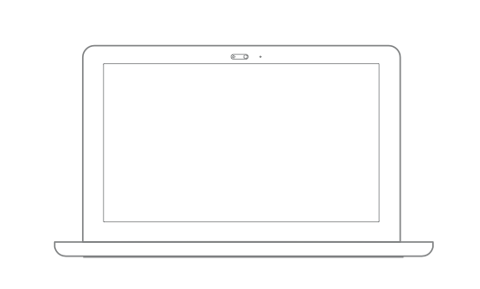
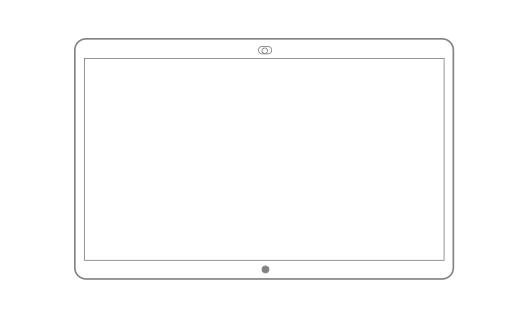

Title: Spark Device Pairing
Desc: Mobile and Desktop Spark Prototype featuring the pairing functions
Cover: prototypes/cover/Spark Pairing_Cover.png

---

#### Mobile Prototype

[https://uxccds.github.io/SparkMobile/SparkMobilePairing/sparkMobilePair.html](https://uxccds.github.io/SparkMobile/SparkMobilePairing/sparkMobilePair.html)

#### Desktop Prototype

[https://uxccds.github.io/Spark-Hype-MVO/devicepairing-desktop.html](https://uxccds.github.io/Spark-Hype-MVO/devicepairing-desktop.html)

#### SparkBoard Prototype

[https://uxccds.github.io/SparkMobile/pair/page/sparkboardpair.html](https://uxccds.github.io/SparkMobile/pair/page/sparkboardpair.html)

# Instructions

### On Mobile

1) For the most optimal experience, use Chrome (mobile mode) or IPhone (webapp mode) to view this prototype.

2) Open the Spark Board prototype and then open the mobile prototype. Press the plus icon on the top right to begin pairing. Click on the blue bar that says, “connecting…” to mimic the prototypes being paired.

3) Select a scenario and continue.

4) If you encounter any issues, clear the browser cache and reload page.
 
### On Desktop

1) Please use Chrome browser to view this prototype.

2) Open the Spark Board prototype and then open the desktop prototype. Press the search icon on the top right to begin pairing.

3) Select a scenario and continue.

4) If you encounter any issues, clear the browser cache and reload page.

### On Spark Board
*Disclaimer: This is simulating an experience on the Sparkboard by using a secondary desktop (e.g. Laptop)*

1. From the laptop, run the prototype in Chrome browser and pair/screen shared to a Spark Board

2. You can use the following hot keys to get to the screens:
	* key space -> black screen
	* key 1 -> the 'hello' screen.
	* key 2 -> the screen with activity menu

