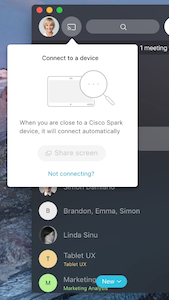
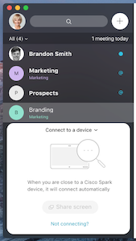

Title: (Desktop) IA Pairing
Desc: A/B Testing for two pairing function placement on Desktop application
Date: 2018-01-14
Cover: prototypes/cover/IA pairing.png
IS_DRAFT: true
---

# Summary

In this user testing session, we tested two versions of pairing function with different element placement

# Links

### Desktop 

[https://uxprototype.cisco.com/projects/Reskin/wap/IA-DevicePairingA.html](https://uxprototype.cisco.com/projects/Reskin/wap/hype/IA-DevicePairingA.html)

[https://uxprototype.cisco.com/projects/Reskin/wap/IA-DevicePairingB.html](https://uxprototype.cisco.com/projects/Reskin/wap/hype/IA-DevicePairingB.html)

# Platform

# Instructions

## On Desktop

1) Version A - click on the pairing icon next to the user Avatar, and follow the flow to connect to a device (Toyshop)

2) Version B - Click on the pairing function button at the bottom of the space list, and follow the flow to connect to a device (Toyshop)

# User Testing
(Coming soon)

