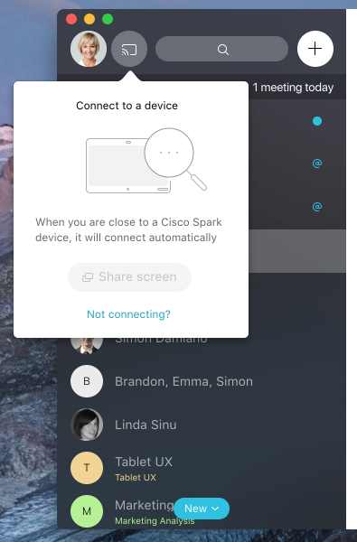
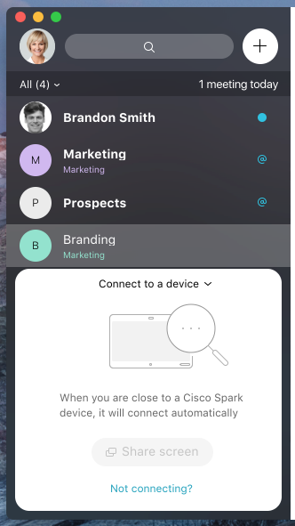

Title: IA Pairing
Desc: A/B Testing for two pairing function placement on Desktop application
Date: 2018-01-14
Cover: prototypes/cover/IA pairing.png
IS_DRAFT: true
---

# Summary

In this user testing session, we tested two versions of pairing function with different element placement

# Links

### Desktop 

[https://uxccds.github.io/Spark-Hype-MVO/IA-DevicePairingA.html](https://uxccds.github.io/Spark-Hype-MVO/IA-DevicePairingA.html)
[https://uxccds.github.io/Spark-Hype-MVO/IA-DevicePairingB.html](https://uxccds.github.io/Spark-Hype-MVO/IA-DevicePairingB.html)

# Platform

# Instructions

## On Desktop

1) Use Chrome browser to view the prototype to see the self-view video working

2) Choose Day 1 to test first time experience (FTE)

3) Choose Day 2 to experience OBPT, PSTN (press 1 to trigger OBTP), and joining a team space

# User Testing
(Coming soon)

## Tested Features:

**Desktop**

**Mobile**

