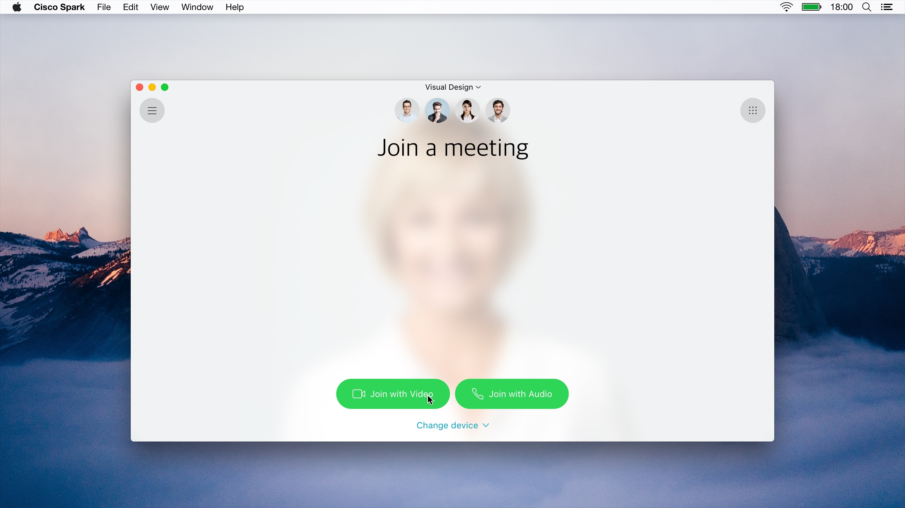
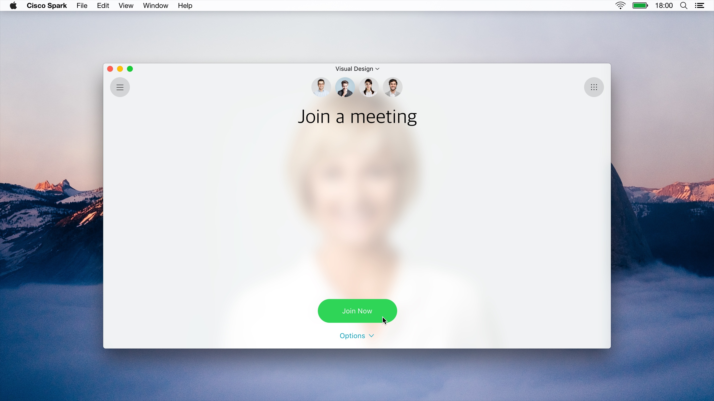
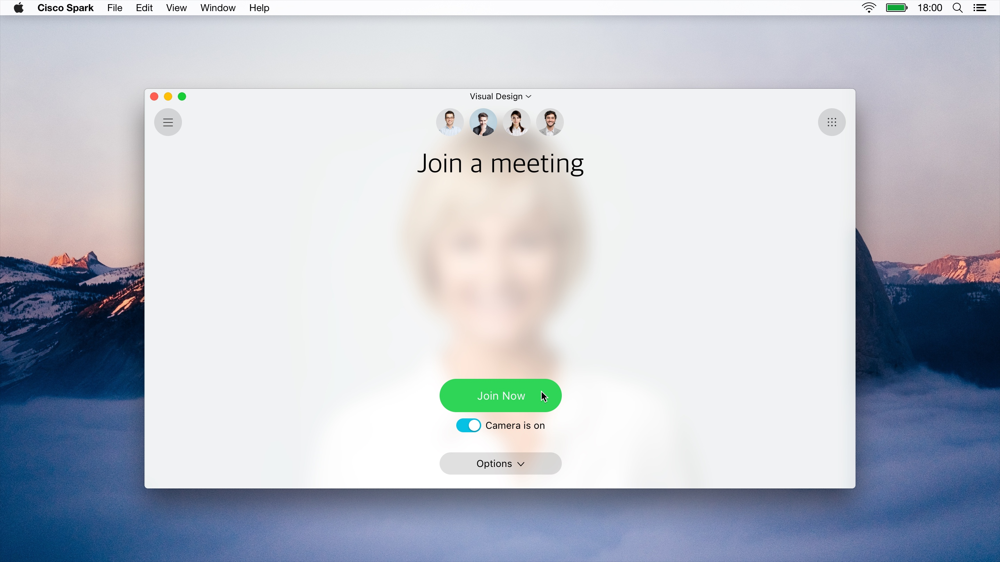
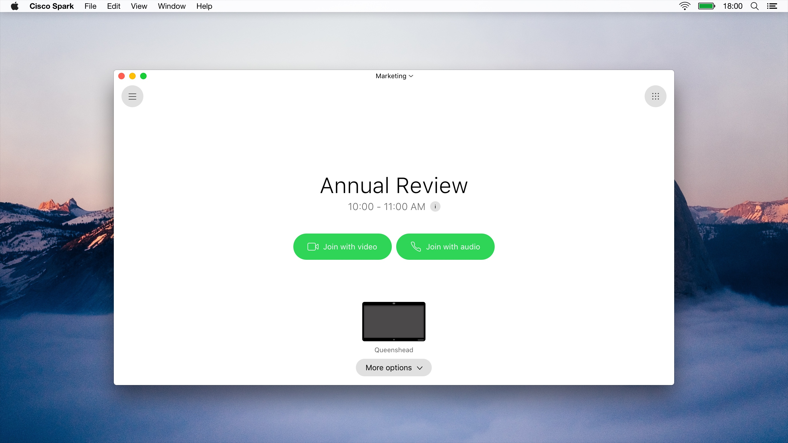
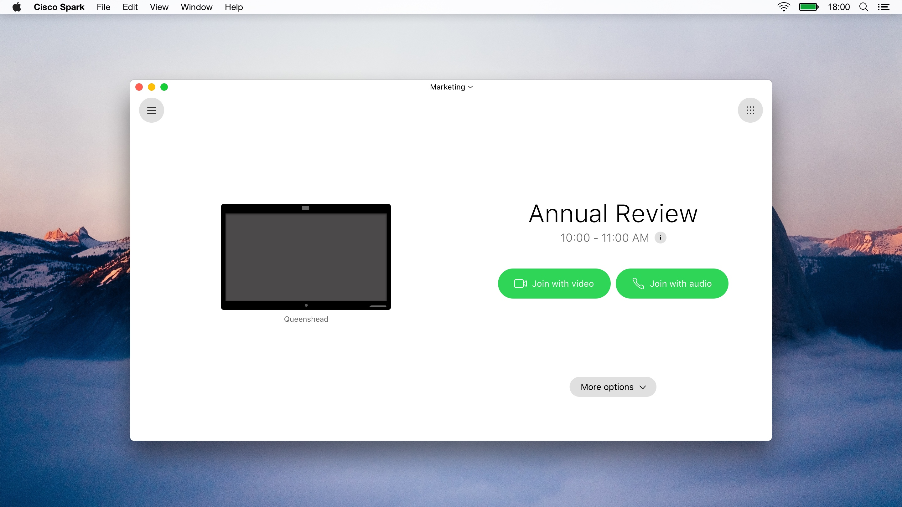
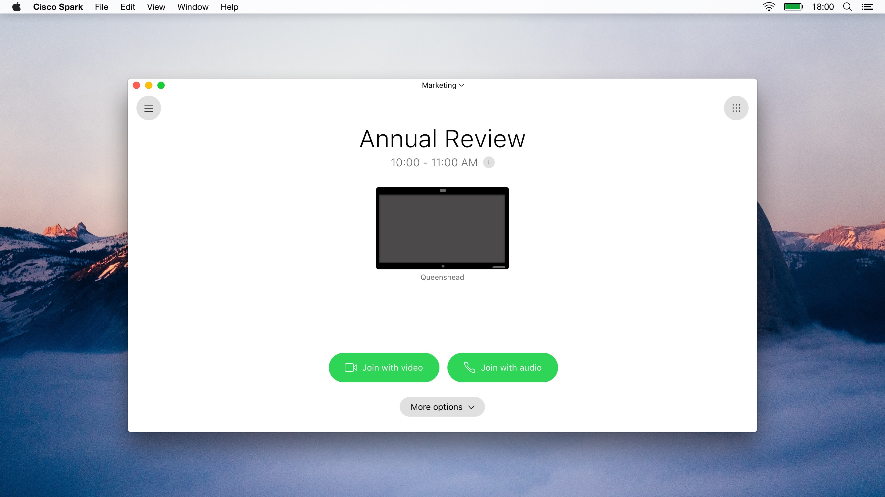

Title: Interstitial Page
Desc: New interstitial structure before users join a meeting
Date: 2017-10-25
Cover: prototypes/cover/Interstitial.png
IS_DRAFT: true
---

#### Desktop 

2) New IA Version 2

[https://uxccds.github.io/Spark-Hype-MVO/IA-UserTesting.html](https://uxccds.github.io/Spark-Hype-MVO/IA-UserTesting.html)

This version compares 3 different interaction elements with either 1 or 2 action buttons

1) New IA version 1

[https://uxprototype.cisco.com/projects/Reskin/wap/IA/IA-interstitial.html](https://uxprototype.cisco.com/projects/Reskin/wap/IA/IA-interstitial.html)

This version compares 3 differnt visual layouts with 2 action buttons

# Instructions

### On Desktop

1) Use Chrome browser to view the prototype to see the self-view video working

2) Choose an experience option (#2, #3, or #4)

3) Choose the "Day 2" experience to skip onboarding process, then press 1 to trigger OBTP

4) Hover over the "Join meeting with video" button to see an un-blurred self view

5) Hover over the "Join meeting with audio" button to see the self-view video background disappear

# Goals	

We aim to utilize this prototype to study how clear each layout presents that matches the users' mental model when joining a meering via Cisco Spark.
