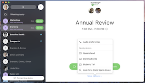

Title: PSTN
Desc: Interstitial page exploration with PSTN implementation
Date: 2018-02-20
Cover: prototypes/cover/PSTN.png
IS_DRAFT: true
---

#### Desktop Prototype

**Phase 2 (New IA)** 
1. [https://uxprototype.cisco.com/projects/Reskin/wap/hype/IA-PSTN.html](https://uxprototype.cisco.com/projects/Reskin/wap/hype/IA-PSTN.html)

2. [https://uxprototype.cisco.com/projects/Reskin/wap/hype/IA-PSTN110117.html](https://uxprototype.cisco.com/projects/Reskin/wap/hype/IA-PSTN110117.html)

3. 

**Phase 1 (Currnet Spark Release)**
1. [https://uxprototype.cisco.com/projects/Reskin/wap/hype/PSTN-Interstitial.html](https://uxprototype.cisco.com/projects/Reskin/wap/hype/PSTN-Interstitial.html)
2. 

#### Mobile Prototype

[https://uxccds.github.io/SparkMobile/PSTN/pstn.html](https://uxccds.github.io/SparkMobile/PSTN/pstn.html)

# Instructions

### On Desktop

1) Use Chrome browser to view the prototype for the best results.

2) In the phase 2 (New IA version), seclect an option (1 or 2) before continuing to Day 1 or Day 2 Scenarios

3) Press key "1" to trigger meeting sessions (OBTP)

4) Press key "1" a second time to trigger the second OBTP

### On Mobile

1) For the most optimal experience, use Chrome (mobile mode) or IPhone (webapp mode) to view this prototype.

2) If you encounter any issues, clear the  browser cache and reload page.

# Goals	
The purpose of the prototype is to test PSTN Scenarios, where the users need to call in to a meeting with their phone. The purpose of this testing is to see whehter this function is clear/obvious to the users, and whether they can compelete the task without too many trial and errors.

# User Testing
## 2/20/2018 Testing 

* [Finding Report](https://cisco.box.com/s/oodohdbdmz6abu6iiyv2q0fnfp7gvm26)
* [Testing Video 1](https://cisco.box.com/s/nk8v5t2o9esvwdjrhlmi99rxw784dbwa)
* [Testing Video 2](https://cisco.box.com/s/v5s7plav713ofais3dbh2lfpu3pps8p9)
* [Testing Video 3](https://cisco.box.com/s/q1j8ecs96a8asfb0n6lg4hawqt5u9g1x)
* [Testing Video 4](https://cisco.box.com/s/g2043nu84r4szzluchhr7xxcoqli8t4w)
* [Testing Video 5](https://cisco.box.com/s/k7dzwkhzvkeacy8pmkqrf0yn1g2tey5r)
* [Testing Video 6](https://cisco.box.com/s/ywr8ydsesk81fr6ue1p1w3vrdj1qi29u)

## 11/17/2017 Testing  
* [Findings Report](https://cisco.box.com/s/kaet4iqikbcevijcr67zcbv1z3ozhncl)

