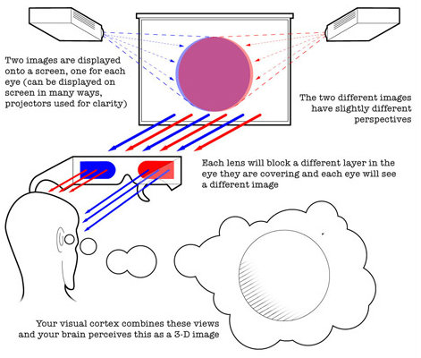
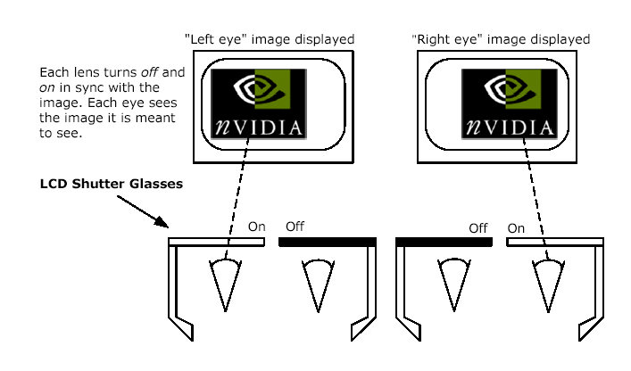
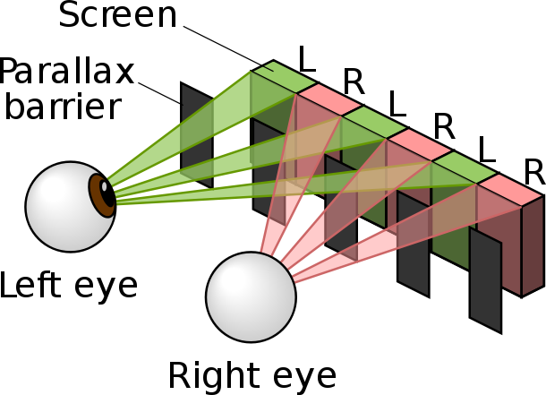

Title: Animation Physics
Cover: research/Animation Physics1.jpg
Author: Arthus Huang
---

## Background

With the development of computer science technology, people are facing more and more information everyday. The traditional static way to display information can't always make our brains excited in the age of information explosion. In this artcile, I will show your the science behind the general animation.

### Persistence of vision

Persistence of vision refers to the optical illusion that occurs when visual perception of an object does not cease for some time after rays of light proceeding from it have ceased to enter the eye. According this phenomenon, people build animation. In ancient China, people draw a bird and a birdcage on different side of a pan. When you twist the pan, you will see the bird in the birdcage. It's the early application of persistence of vision. 

### Television broadcasting system and frame

According to the persistence of vision, people can watch animation if we play a series of images in a very short time. But how  short the time is? TV in the era of the use of analog signals, television broadcasting system mainly PAL, NTSC, SECAM three, they were using different frame rates. NTSC requires 25 frames in a second while PAL and SECAM require 25 frames in a second. In lastest monitor can play 240 frame a secord, it bring a better experience of watching animation.

### 3D

3D movie technology has improved sharply in the passing years. The following images will show you why we can see 3d movies.

Red and blue glasses 

LCD shutter glasses

Naked eye 3D screen

Whatever the technology we use, the key why we can see 3d movied is our brain. Our brain can merge 2 images into one! 

### Acoustics

The early movies are black and white and silent, but the sound is clearly indispensable. The sound also has its 3D world! Our brain can also composite the sound you hear from left ear and right ear. I believe the acoustics is a very big topic so that I'd like to further this topic in the other articles.

## Summary

Thanks to our brains, we can see and hear the 3d world. It is also our brains that give us the feeling of the world. 

