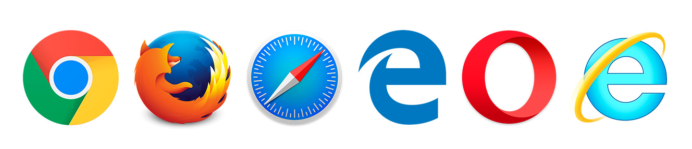

Title: Animation in browser
Cover: research/Animation in browser.jpg
Author: Arthus Huang
---

## Background

October 2014m HTML5 standard officially released. In the ealier time, the only officially standard was the HTML 4.01 which was released in 1999. Obviously, the HTML4 has been out of data for a long time. At the begining of the 21st century is a period of rapid development of the internet. In order to meet the increasingly complex requirements of the interaction, Java Applet, ActiveX, Flash, Microsoft Silverlight, SVG and the other front-end technology bloom in that era. Then we went through a battle of browser. In that time, developers have to write one style 4 times (-o, -webkit, -moz, -ms). Of course, there are still many ways to avoid writting 4 times. Sass, Less and some other solutions came to the world. Almost at this time, the internet for mobile rose. Because Android and IOS's native browser both use the webkit core, it is more convenient to coding HTML5 for mobile.

The diversity of technology must lead to the increase in learning. Apple killed flash when it delivered the IPhone4. HTML5 standrad came to the word eventually.

HTML5 defines simple animation, excessive, browser storage, multi-threaded, websocket and some other features which only appeared in the native system in the past. However the battle of browsers never ends. The barriers always exists in the latest technology field. After few years of PhoneGap, a wind of React Native blows up. Web Audio is still a draft, it's still hard to apply 3D TV technology in browser. The good news is that we have more and more technoloy for our creation.

### GPU&CPU

In the early browser, the task is single-threaded. All the work for graphic, network and calculation is done in one thread. In the absence of WebGL and CSS3 era, engineers never think about the GPU in front-end programming. With the development of HTML5, graphics technology has been rapid improved. Hardware acceleration went into thr front-end engineers' eye sight.

Before diving in the browser, let's figure out the difference between CPU and GPU. According to John von Neumann's computer system, the computer consists of operator, controller, memory, input device and output device. CPU is known as the operator of the computer while GPU slowly went the public eye in the current years. Modern CPU using multi-core design, each core has a large enough cache, you can handle a variety of complex operations. GPU has more cores compared to each, but each core cache is smaller relative to the CPU. GPU is more suitable for 3D rendering calculations.

In the browser, CPU does the the traditional DOM operation and 2D animation calculation while GPU take the response of rendering WebGL and 3D things. There are many APIs in the traditional DOM for Javascript calls, Dom's data structure can be repeatedly read and modified, which is more dependent on the cache. In WebGl, the content of the Canvas can not be read once it is rendered, and the programmer usually creates other data structures to store the data model, and each rendering is relatively independent. The real scence of browser's rendering, CPU and GPU are usually used together.

### CSS animiation

In CSS3, there are 2 new properties, transition and animation. We can only use CSS3 to build some simple animation. But more importantly, we can get a glimpse of some of the basic elements of animation. Duration, delay, time-function, and property are necessary elements. Compared to Javascript animation, CSS3 animation rendering process is the browser automatically, the code level of the control ability is more weak. In a browser that supports matrix transformations, transform's animated browser optimizes itself and the browser automatically use GPU to do the hardware acceleration .

### Dom animation

DOM animation relative to the Canvas animation, which are elements can be directly interactive, more consumption of CPU resources. In the process of rendering the browser interface, redraw and rearrangement has been happening, and will produce greater performance consumption. The redraw occurs when the style attribute of the element changes, and the rearrangement occurs when the element's position property or the DOM tree changes. In the DOM tree, the rearrangement of the parent node causes the rearrangement of the child nodes, and the absolute positioning elements that get rid of the document flow are relatively more suitable for DOM animations.

### Canvas animation

Canvas has 3D and 2D rendering modes. Different from the DOM element, Canvas inside the graphics can not be drawn after the need to clear the drawing board to redraw. If you need to store any information, you need to use Javascript to create some other objects to save. Because the redraw of the entire Canvas will bring a lot of performance consumption, the common optimization method is part of the redraw Canvas and multiple canvas to achieve animation.

### SVG animation

SVG is an extensible markup language used to describe vector graphics. In early browsers, SVG existed as a plugin, and modern browsers built support for SVG. SVG also has some of the features of the DOM and Canvas elements. First, all SVG elements can be assigned an ID and then operated directly via the Javascript API. By changing the element properties, you can change its appearance. Compared to DOM elements, SVG elements can show more richer images, and almost all vector graphics can be represented by various Bessel curves. Bessel curves can be converted directly to each other, a lot of irregular graphics transition animation is based on SVG. 

### Timeline

Animation is based on the art of time, no matter what technology you use to achieve animation, time is a very important element. In the browser, there are two kinds of basic units of time, natural time and frame number of two units. The two units can be converted to each other, but will be subject to the calculation of the thread resources. Animals in natural time are animations such as CSS animations, SVG animations, and Javascript in APIs such as setTimeout, setInterval, and so on. And requestAnimationFrame is based on the number of computer frames to achieve animation. Relatively speaking requestAnimationFrame is more suitable for drawing animation, better performance. SetTimeout and setInterval Although the same function can be implemented on a surface with different APIs, the browser is not the same in the threading mechanism of the browser. The difference here is especially true when the browser resources are tight.

## Summary

With the knowledge of browser, we can focus more on the detail of animation. It meams both better experience and more smooth communication with the engineers.