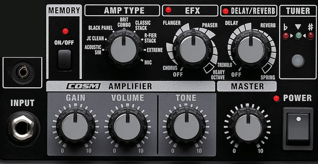
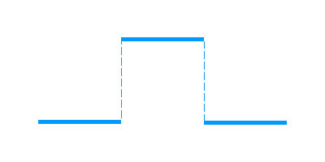
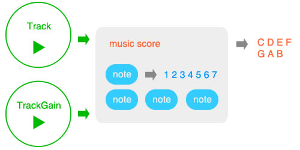

Title: Write music with HTML5
Desc: This article will tell you how to write a tune with pure Javascript and introduce an interesting Javascript framework to you.
Date: 2015-2-11
Cover: research/Write a music score by HTML51.jpg
Author: Arthus Huang
SortIndex: 1
---

## Background

Before a baby opens his eyes, he knows the word by his ears at the very begining. This shows that sound is a very improtant element of interaction. But designers and engineers usually pay more attention to the visual than the sound. As we all know, sound wave is a kind of mechanical wave. By the physical propreties of wave, we can do many interesting things.

## Compose Music

Software engineers are tinking with 1 and 0 to build their utopia while musicians play with music notes to construct their Garden of Eden. It should be fantastical when coding meets with music. Music will enrich the user experience of software, and coding will make people learn more about the struct of music.

A melody consists of a variety of music notes, while time value and pitch are the most important propreties of music notes. In the following paragraph, I will introduce how to create a music note with Javascript.

People can identify music notes of different pitches because every music note has its own frequency. According to the  Web Audio Api, we can create an oscillator node. This node can create a sound wave with a specified frequency. You can do some tests refer to the following code.

```
var context = new webkitAudioContext(),
     osc  = context.createOscillator();
	osc.frequency.value = 440;
	osc.connect(context.destination);
	osc.start(0);
```

The code above created an osicallator with a freqency of 440 hz.  According to equal temperament, 440 hz is the frequency of 'LA'. In twelve-tone equal temperament, which divides the octave into 12 equal parts, the width of a semitone, i.e. the frequency ratio of the interval between two adjacent notes, is the twelfth root of two. So we can get the freqency of other notes refer to the following code.

```
var MusicalAlphabet = ['C','C#','D','D#','E','F','F#','G','G#','A','A#','B'],
    freqChat={},
    freqRange=3,
    i,j,base;

for(i=1;i<freqRange;i++){
    freqChat[i]={};
    base = (i-1)*12;
    for(j=0;j<12;j++){
        freqChat[i][MusicalAlphabet[j]]=440*Math.pow(2,(base+j-9)/12);
    }
}
```

I recommend to calculate all the notes' frequency at the beginning of script.  Now, we can get the pitch of every note. The next step is to deal with the time value. The most simple way is to use the function 'stop' and 'start' of the instance of the oscillator node. You can refer to the following code.

```
var context = new webkitAudioContext();
var osc  = context.createOscillator();
osc.frequency.value = 440;
osc.connect(context.destination);
var _c = context.currentTime;
osc.start(_c+1);
osc.stop(_c+2);
```

You may have noticed the variable _c . In the context of web audio, it has its own timeline. The property 'currentTime' of context is the only way to access to this timeline. All the nodes of the context play according to this timeline. The funtion 'start' need an argument to define the start time of the oscillator node. If this argument is smaller than contecxt.currentTime, the function 'start' will execute immediately.  

Unfortunately, the function 'start' of each instance can only be called only once.  It means that once you have called the function 'stop', you will have to create a new instance to play the same note. So I recommand another solution to you. The key is the gain node. With gain node, you can control the signal strength of the osciallator node. If you have ever played the guitar amp, you can understand this node better.



Let's back to the coding world.

```
var context = new webkitAudioContext(),
    gain = _ctx.createGain(),
    osc  = context.createOscillator(),
    _c= context.currentTime;
osc.frequency.value =440; 
gain.gain.value=0;
osc.connect(gain); 
gain.connect(context .destination); 
osc.start(_c);
gain.gain.setValueAtTime(1,_c+1);
gain.gain.setValueAtTime(0,_c+2);
```

The code above can play a music note 'La' (at c major) from 1s to 2s. You can set the value of gain.gain.value from 0 to 1. When this value is set to 0, it works like that you call the function 'stop'. The following picture shows the change of the signal.



Besides the function 'setValueAtTime' , gain node has some other methods to change its value. You can find them in the web audio api.

By now, you should be able to play a music note during some time by javascript. But it still has a lot of things to do to achieve a music score. In the following part of this article, I will teach you how to create a music score with a javascript framework named 'Jsonic'.

Play a music score with Jsonic

Jsonic is a small and feature-rich javascript library. With Jsonic, you can compose music, transfer data by ultrasound, make sound wave visualible, do speech recognition and so on. You can get Jsonic from [jsonic.net](https://jsonic.net) jsonic.net or [github](https://github.com/ArthusLiang/jsonic).



The picture above shows the struct of Jsonic's melody module. You need create an instance of Track of TrackGain to play a music score. The music score consists of many notes. Let's move on to the detail code.

### create notes

```
var note = new Jsonic.Melody.Note(1,1/4,0,false);
```

You can create a music note according to the code above. In Jsonic, every instance of Jsonic.Melody.Note refers to a music note. The constructor of Note could accept 4 arguments. The first one is rollcall while the third argument defined which octave this note is in. Jsonic.Melody.Note use rollcall (0,1,2,3,4,5,6,7) to create instances so that you can change the tone in MusicScore easily. If you want to get a central C, the third argument should be 0. The second argument defines the time value(1,1/2,1/4,1/8,1/16) of notes. The speed of MusicScore is another element which affects the real time value of the note .The 4th argument  defines whether this note has a dot.

### create music score

```
var musicScore = new Jsonic.Melody.MusicScore('C','major','4/4');
```

When you create an instance of MusicScore, you can define it's tone and beat. The code above create a 4/4 c major music score. You should use musical alphabet here.

After you have created a music score, you could add notes to the music score according to the following code.

```
musicScore.w(new Jsonic.Melody.Note(3),new Jsonic.Melody.Note(4));
```

The function 'w' will append all its arguments to the end of the music score. The next step is to create an instance of Track or TrackGain to play the music score. But you should call the function 'compile' firstly.

```
musicScore.compile();
```

### play music

As what I mentioned at the begining of this atricle, we have two ways to control the time value of notes. Track and TrackGain are corresponding to these two ways.

```
var track = new Jsonic.Melody.Track();
track.play(musicScore,90);
```

The code above created a track and played a music score with the speed 90. The value of the speed refers to the data in metronome.

If you still feel confuse, please click the [demo](http://jsonic.net/demo/index.html). (Click the start button)

## Summary

Web audio offers a lot of nodes. You can connect them to here and there. It is like playing the guitar amp. Hope you can find some interesting effects with web audio.